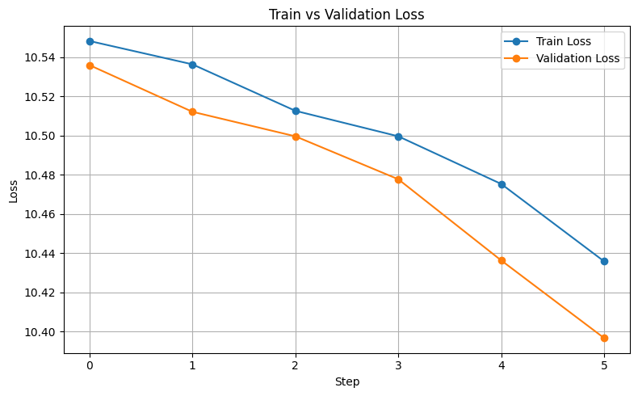

# Building and Training a Llama-2 Model from Scratch using Multiple GPUs

This project contains all the necessary code and instructions to build and train a Llama-2 model (see the [References](#References) section) from scratch. While thie repository is based on the 7B-parameter Llama-2 architecture, it has been optimized for better computational efficiency by replacing traditional multi-head attention with grouped-query attention, a technique adopted in more recent Llama versions.

## Setup

To get started with this project, follow the steps below to set up your environment and dependencies.

### 1. Clone the Repository

Clone the repository to your local machine:

```bash
git clone https://github.com/amirdy/Building-and-Training-a-GPT-2-Model-from-Scratch.git
cd Building-and-Training-a-Llama-2-Model-from-Scratch
```

### 2. Install Dependencies

Install the required Python packages using `pip`:

```bash
pip install torch torchvision torchaudio --index-url https://download.pytorch.org/whl/cu118
pip install -r requirements.txt
```

### 3. Train the Model with multiple GPUs

To train the model from scratch, use the provided `main.py` script. This script sets up the data, model, and training loop:

```bash
torchrun --standalone --nproc-per-node=2 main.py
```

### Explanation of the Command

- `torchrun`: A utility provided by PyTorch for launching distributed training jobs.
- `--standalone`: Indicates that the training will run on a single machine.
- `--nproc-per-node=2`: Specifies the number of GPUs available on the machine. In this case, it assumes 2 GPUs are available.
- `main.py`: The main script that initializes the model, loads the dataset, and starts the training loop.

### Example Usage

If you have 4 GPUs on your machine, you can modify the command as follows:

```bash
torchrun --standalone  --nproc-per-node=4 main.py
```

### Note

- Ensure that your system has the required number of GPUs and that they are properly configured with CUDA.


The training script will save the best model checkpoint in the `ckpt/` directory, which can later be used for text generation.

## Configuration

The model and training configurations are defined in the [`config.py`](config.py) file. You can adjust the hyperparameters and other settings as needed.

### Example `config.py`

```python
from dataclasses import dataclass

@dataclass
class LlamaConfig:
    vocab_size = 32000         # Vocabulary size
    context_length = 4096      # Context length
    emb_dim = 4096             # Embedding dimension
    n_heads = 32               # Number of attention heads
    n_layers = 32              # Number of layers
    qkv_bias = False           # Query-key-value bias
    num_groups = 8             # Numer of groups for GQA 
    intermediate_size = 11008  # Size of the hidden in FeedForward  

@dataclass
class TrainingConfig:
    max_steps = 500000 
    warmup_steps = 2000 
    max_lr = 3e-4   
    min_lr = 3e-5  
    weight_decay = 0.1  
    batch_size = 1
    grad_accum_steps = 1024 
    max_new_token = 100
    temperature = 1  
    top_p = 0.9   
```


## Dataset
 The *TinyStories* dataset (see the [References](#References) section), consisting of short and simple stories, was used for training. 


## Results
The model was trained on 2×H200 SXM GPUs for 6 steps, which took approximately 50 minutes. Training was halted due to resource constraints. Below are the training and validation losses recorded during these steps:




## DDP (Distributed Data Parallel) details
To train the model using multiple GPUs, we used Distributed Data Parallel (DDP). TThe important parts for implementing DDP are outlined below:
- In the **main.py**: 
    ```python
    init_process_group(backend ='nccl')
    ddp_rank = int(os.environ['RANK'])
    ddp_local_rank = int(os.environ['LOCAL_RANK'])
    ddp_world_size = int(os.environ['WORLD_SIZE'])
    device = f'cuda:{ddp_local_rank}'
    torch.cuda.set_device(device)
    master_process = ddp_rank == 0 # Only the master process will print logs and save checkpoints   
    ```
    Explanation: 
    - rank: Global index of the current GPU.
    - local_rank: Index of the GPU on the current node (machine).
    - world_size: Total number of GPUs across all nodes.
    ```python
    model = DDP(model, device_ids = [ddp_local_rank]) # Wrap the model with DDP for distributed training
    model = model.module # Get the original model from DDP wrapper
    ```
- In the **trainer.py**: 
    ```python
    if self.ddp:
        self.model.require_backward_grad_sync = (i == (self.grad_accum_steps - 1) ) # Synchronize gradients across all processes
    loss.backward()  
    ```
    Explanation: 
    -  The second line controls when DDP should synchronize gradients across GPUs. 
    - In Distributed Data Parallel (DDP), each GPU works on its own slice of data. After backpropagation (loss.backward()), DDP automatically synchronizes gradients between all GPUs so they stay in sync for the optimizer step. But if you're using gradient accumulation, you’re calling loss.backward() multiple times before calling optimizer.step().
    The problem is if DDP syncs gradients every time you call .backward(), the gradients across each process (GPU) will be averaged prematurely, even before you're ready to apply the accumulated gradients.To solve this issue, the second line is needed! It tells DDP:“Only sync gradients on the last accumulation step (i == grad_accum_steps - 1).” By using that line, you're ensuring that gradients are only synchronized at the correct moment — after the full set of accumulation steps — leading to accurate and stable training results.

    ```python
    if self.ddp:
            torch.distributed.all_reduce(loss_accum, op=torch.distributed.ReduceOp.AVG) # Average the loss across all processes
    ```
    Explanation:
    - ws


 
- In the **data_module.py**: 
    ```python
    DataLoader(self.train_dataset, shuffle = False, sampler = DistributedSampler(self.train_dataset, shuffle=True), batch_size = self.batch_size, drop_last = True)

    ```
    Explanation: 
    -  This is crucial for DDP. The DistributedSampler ensures that each process (or GPU) gets a distinct subset of the data.

## Llama-2 vs GPT-2
- **Tokenizer**: Llama-2 uses Google's SentencePiece tokenizer instead of OpenAI's Tiktoken.
- **Positional Embedding**: In Llama-2, positional embeddings use RoPE (Rotary Positional Embeddings), while GPT-2 uses learned absolute positional embeddings.
- **Attention mechanism**: In Llama-2, attention is typically Grouped Query Attention (GQA), while GPT-2 uses standard Multi-Head Attention (MHA).
- **Normalization**: Llama-2 uses RMSNorm while GPT-2 uses LayerNorm. 
- **Activation**: Llama 2 uses SiLU activation (Swish) in its feedforward layers, while GPT-2 uses GELU activation.


Please refer to [this file](https://github.com/rasbt/LLMs-from-scratch/blob/main/ch05/07_gpt_to_llama/converting-gpt-to-llama2.ipynb) by Sebastian Raschka, as it provides a comprehensive and well-articulated explanation.
## Repository Structure

The project has the following structure:

```
dataset/
    data_module.py
    dataset.py
models/
    feed_forward.py
    silu.py
    llama.py
    layer_norm.py
    group_query_attention.py.py
    transformer_block.py
ckpt/
config.py
trainer.py
main.py
generate_tokens.py
README.md
```

- `dataset/`: Contains the dataset-related modules.
  - `data_module.py`: Handles data loading and preprocessing.
  - `dataset.py`: Defines the dataset class.
- `models/`: Contains the model-related modules.
  - `feed_forward.py`: Defines the feed-forward network.
  - `silu.py`: Defines the SiLU activation function.
  - `llama.py`: Defines the Llama model.
  - `layer_norm.py`: Defines the layer normalization.
  - `group_query_attention.py`: Defines the Group Query Attention (GQA) mechanism.
  - `transformer_block.py`: Defines the transformer block.
- `generate_tokens.py`: Script for generating raw token sequences from the dataset.
- `config.py`: Contains the configuration classes for the model and training.
- `trainer.py`: Contains the training loop and related functions.
- `main.py`: Main script for training the model.

## License

This project is licensed under the MIT License.

## Useful Resources


- **Sebastian Raschka**: Author of [Build a Large Language Model (From Scratch)](https://www.amazon.com/Build-Large-Language-Model-Scratch/dp/1633437167), for providing valuable insights and guidance on building large language models. Reference: Raschka, Sebastian. Build A Large Language Model (From Scratch). Manning, 2024. ISBN: 978-1633437166.


## References

- Touvron, Hugo, et al. "Llama: Open and Efficient Foundation Language Models." arXiv preprint arXiv:2307.09288 (2023). [Llama 2 Paper](https://arxiv.org/abs/2307.09288)
- Eldan, Ronen, and Yuanzhi Li. "Tinystories: How small can language models be and still speak coherent english?." arXiv preprint arXiv:2305.07759 (2023).

